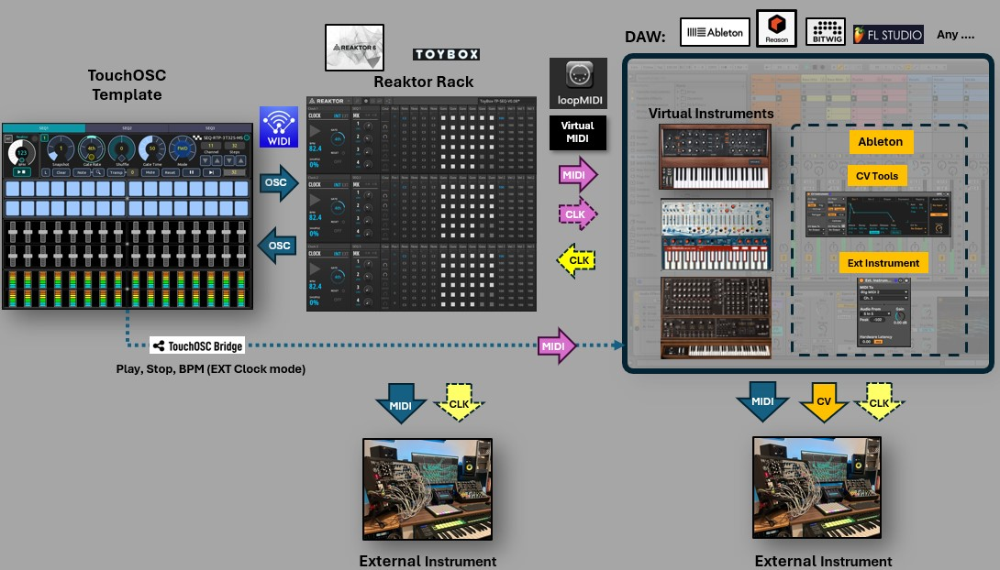
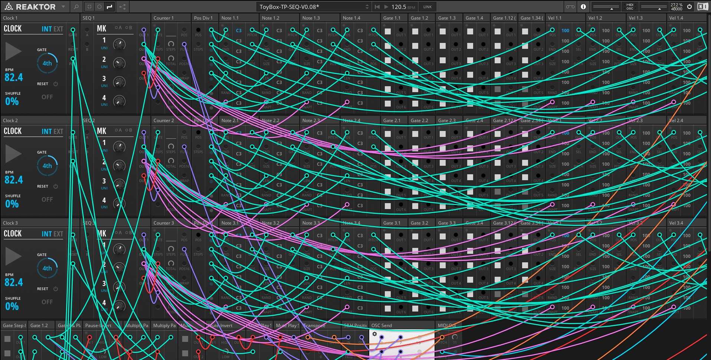

## Reaktor ToyBox Tangle Pack Sequencer
### TouchOSC Template for a Custom Built Reaktor rack sequencer

- Instrument: Reaktor ToyBox **Tangle Pack** Sequencer, 3 tracks, 32 steps, MIDI
- Model: TBT-332
- Version: 1.0 
- 

 

## Contents
- [Description](#description)
- [Operation](#operation)
- [User Guide :link: ](USER_GUIDE.md)
- [Instrument](#instrument)
- [Sequencer](#sequencer)
- [Reaktor rack](#reaktor-rack)
- [TouchOSC Connections](#touchosc-connections)
- [Requirements](#requirements)
- [Files](#files)
- [License](#license)
- [Support the Author](#support-the-author)

## Description
A TouchOSC template to control and play with a tablet device a **CUSTOM BUILT** Reaktor Sequencer of 3 tracks, 32 steps, using the [ToyBox Tangle Pack](https://www.toyboxaudio.com/pages/tangle-pack) modular blocks. It "materializes" physical sequencer in a tablet midi controller for your musical production workflow to jam and inspire your productions.

## Operation
Reaktor runs in **standalone** mode outside of a DAW using the custom built rack (preset) file included in the repository. The template is the midi controller, Reaktor is the sequencer instrument that can play either a virtual intrument in a DAW or a external instrument. Communication between the template and Reaktor use OSC protocol, with Reaktor being the OSC host. Communication between the template and a DAW use MIDI protocol, with the DAW being the Transport control and the external clock source. Clock synchronization between Reaktor and a DAW can be in 3 modes:

 

### Clock Mode 1: Reaktor internal Clock
In this mode Reaktor is the master clock source. Select INT as the clock source in the template. You can optionally configure Reaktor as the master clock if you want to send MIDI Clock to a DAW or a external gear. Configure your DAW or your external synthesizer or modular gear to receive and sync to a external clock source provide by Reaktor. Each DAW and external gear handles clock configuration slightly differently, so how you enable clock synchronization to a external source may require specific setup steps in each environment.

### Clock Mode 2: Ableton Link
In this mode Ableton Link works as the master clock source. Toogle INT and select Link as the clock source in the template. Enable Ableton Link in Ableton and Reaktor. Configure your external synthesizer or modular gear to receive and sync to a external clock source provided by Ableton. Each external gear handles clock configuration slightly differently, so how you enable clock synchronization to a external source may require specific setup steps in each environment. You will also require to configure in Ableton the MIDI mapping for the transport controls (play/stop/BPM) and adjust the BPM scaling from 20 to 240.

### Clock Mode 3: External Clock (Reason)
In this mode Reason (or any other DAW) works as the master clock source. Toogle INT and select EXT as the clock source in the template. Enable "Sync to External Clock" in Reaktor to receive clock from your DAW and enable clock send in your DAW. Configure the MIDI clock sync output to use a virtual MIDI port. **Important**: This mode 3 can be used with any other DAW that can send MIDI clock sync signal.  Each DAW and external gear handles clock configuration slightly differently, so how you enable clock synchronization to a external source may require specific setup steps in each environment. You will also require to configure in your DAW the MIDI mapping for the transport controls (play/stop/BPM) and adjust the BPM scaling accordingly. BPM scale is already configured to use Reason DAW in the template side. 

### Virtual MIDI ports
A virtual midi port in your computer is requiered to communicate Reaktor with your DAW. You require to setup in Reaktor the virtual MIDI ports interfaces. On a PC you can use [loopMIDI](https://www.tobias-erichsen.de/software/loopmidi.html) to create virtual midi ports. On a Mac, you can use the IAC bus to create any number of virtual MIDI buses. This driver can be activated in the Audio MIDI Setup Utility.

### Snapshot sync and midi takeover
As long as your template and your DAW session are open, the sequencer values and snapshots are in sync. But once you close any of them, further changes will lose sync. To keep it in sync, it is recommended to manually save your template and the Reaktor rack session simultaneously before closing, to keep your session and the snapshots values and continue working later by recalling them. Be aware that TouchOSC does not support automatic template saving, so you must do it mannualy. Also be aware that the template uses "absolute" scaling, so you occasionally will need to move the controllers to pick up the correct value. Recommended: You can automate the workflow with a steam deck device. 
 
 

## Instrument
- Instrument: **Custom built** sequencer using blocks from Reaktor libraries.
- Plugin: Native Instruments - Reaktor 6 
- Libraries:
	- [ToyBox Tangle Pack](https://www.toyboxaudio.com/pages/tangle-pack) 
	- [ToyBox Free Pack](https://www.toyboxaudio.com/pages/free-pack-details) 
	- [Reaktor Blocks Base](https://www.native-instruments.com/en/products/komplete/synths/reaktor-6/blocks/)
- Main Modules: Sequencers, Utility
- Operation Mode:  Standalone
- DAW Host:  Any DAW
- MIDI: Virtual MIDI port 

## Sequencer
- Tracks: 3 tracks 
- Steps: 32 steps per track, melodic sequencer
- MIDI out: Pitch, gate (with velocity level)
- Modulation: Velocity, Gate time, Shuffle
- 8 Sequencer modes: 
	- fwd  
	- rev  
	- fwd-rev 
	- tri
	- patt1
	- patt2
	- rand
	- glitch
- **Snapshots:** up to 4 to store and recall sequencer values
- Link: Link changes in command values
- Clear: Initialize all values
- Reset: reset to initial position 
- Transpose: +24 to -24 interval keyboard in the template
- Mute: Mute output
- Pause: Pause sequencer
- Step: 1 step forward
- Clock: 3 modes: Internal (Reaktor), External - Ableton Link, External- Sync Clock  
- OSC return: Return control sequencer values to the template (gate, position, play)

## Reaktor rack
- Custom Built Rack: use of sequencer note, gate, level, ramp, counter, clock and utility.
- Blocks: 
	- [ToyBox Tangle Pack](https://www.toyboxaudio.com/pages/tangle-pack) 
	- [ToyBox Free Pack](https://www.toyboxaudio.com/pages/free-pack-details) 
	- [Reaktor Blocks Base](https://www.native-instruments.com/en/products/komplete/synths/reaktor-6/blocks/)
- Blocks Mapping: OSC  
- Reaktor OSC Configuration: 
	- OSC Activate ON 
	- Receive on Port 10000 
	- OSC Send (Identifier Target, Tablet device IP address, Port 10000)
- Rack File: TBT-332-v1.0.nksr

 

## TouchOSC Connections
- Reaktor Mapping: OSC (already mapped)
- DAW Host Mapping:  MIDI 
- Tablet device TouchOSC Connections: 
	- MIDI Connection 1 : Send Port: Bridge, Receive Port: Bridge
	- OSC Connection 1: Host (IP of PC host), Ports: send 10000, receive 10000
	- OSC Connection 2: Host (IP of PC host), Ports: send 12101, receive 12101   (This connection required to send keystrokes)
	- Bridge: Host(IP of PC host)
- Virtual MIDI interface: Virtual midi ports on the PC or Mac to communicate Reaktor with DAW
- Physical MIDI: To communicate Reaktor with external gear

## Requirements
- Control surface software: TouchOSC
- Tablet: An iOS or Android Tablet
- DAW: (Optional) Ableton Live 11/12 or any other DAW with Send Clock feature. (Only required for clock modes 2 and 3) 
- Plugin: Native Instruments - Reaktor 6
- Reaktor Blocks: 
	- [ToyBox Tangle Pack](https://www.toyboxaudio.com/pages/tangle-pack) 
	- [ToyBox Free Pack](https://www.toyboxaudio.com/pages/free-pack-details) (OSC send block) 
	- Reaktor Blocks Base](https://www.native-instruments.com/en/products/komplete/synths/reaktor-6/blocks/)
- Target virtual instrument: Any virtual instrument in your DAW
- Target external instrument:  Any external midi instrument
- MIDI: Virtual MIDI ports

## Files 
- TouchOSC template: TBT-332-v1.0.tosc
- Reaktor rack:      TBT-332-v1.0.nksr

## License

All assets and code are under the MIT LICENSE in the public domain unless specified otherwise.

---

## Support the Author

 
I'm passionate about creating code that brings joy, inspiration, and creativity into people's lives. If you've enjoyed what I share and want to support my work, your contribution will help me to continue building. Every little bit fuels my creativity.

**_Thank you for your kindness and support!_** 

