## Reaktor ToyBox Tangle Pack Sequencer
### Custom Built Reaktor rack and TouchOSC Template

## USER GUIDE
This guide explains the setup, usage and control of the **CUSTOM BUILT** Reaktor ToyBox Tangle Pack Sequencer. 

## Contents
- [TRANSPORT](#transport)
- [CONTROL](#control)
- [SEQUENCER](#sequencer)
- [CONNECTIONS](#connections)
- [REAKTOR RACK](#reaktor-rack)
- [IMPORTANT NOTES](#important-notes)


## TRANSPORT

<div align="center"> 
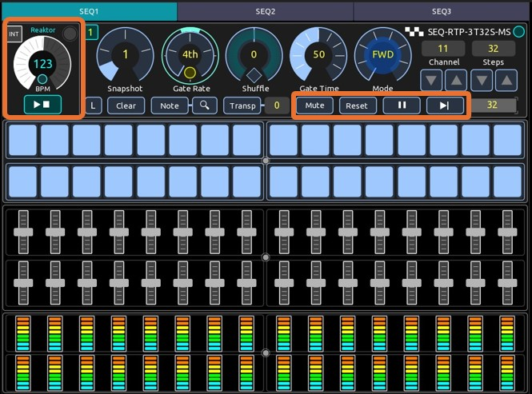
</div>

### Clock
Selects Internal, Ableton Link or an External clock source. The Play and Stop controls and BPM scales change depending on the option selected. If you press and toogle INT, two options are available pressing the right round button: **Link Ableton** and **EXT Reason**. The EXT option shows **Reason** because the template has the BPM values already scaled to this DAW. But you have the option to change it if you use any other external DAW. 

- **INT**: This option selects Reason as the clock source. You could use Reaktor as the master clock source for your setup if you select the option "Send clock to MIDI ouput"  in the Settings menu.

- **LINK**  **Ableton Link**: This option selects Ableton Link as the clock source. Manually Enable **Link** in Ableton as well as in Reaktor.  

- **EXT**  **Reason** : This option selects an external DAW clock source. The template displays **Reason** because the BPM values are already scaled for Reason. But you can change to your DAW and modify the script to match the BPM scales of your DAW. 


<div align="center"> 
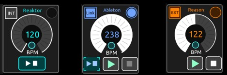
</div>

<br>

<div align="center"> 
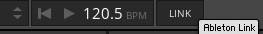
</div>


### BPM
Selects the BPM values for the 3 sequencers depending on the clock source: 

-- **INT** : Use the BPM values from the Reaktor rack. Values are from 1 to 240. Already OSC mapped. 

-- **EXT - Ableton Link** : Use the BPM values from the Ableton DAW. Values are from 20 to 240. Manualy do the midi mapping and ajust the BPM scale in Ableton to the 240 max value. 

-- **EXT - Reason** : Use the BPM values from the Reason DAW (or any other you use). Default values are from 1 to 244. Manualy do the midi mapping. If you use any other DAW, modify in the template script the MIDI Control Change message of the **BPMRS** control. The default value for Reason adjusted  from 0 to 30.  Change it and adjust to your DAW as needed. To change the name to your DAW, locate in the script the INTEXT and DAW controls the variable daw_ext and change its value. 

 
<div align="center"> 
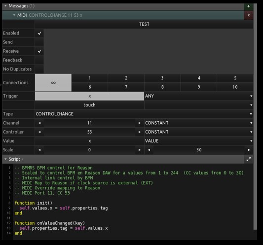
</div>

```
local daw_ext = 'Reason'      -- Change it to your DAW as needed

````

### Play / Stop
Play and Stop the 3 sequencer tracks. It has 3 modes of operation, depending on the selected clock source:

- **INT** clock mode: PLAY/STOP play and stop de Reaktor rack. Only one play button is displayed OSC mapped to Reaktor.

- **EXT** CLock + **Ableton Link** : Two play buttons, the left one is for Reaktor and the right one is for Ableton.  Manually do the midi mapping of the middle PLAY button to Ableton. Reaktor can play or stop independently of Ableton, but is linked in beat, phase and tempo to the master clock of Ableton. Note: Ableton can start play in Reaktor if the sync option is selected in the midi output ports settings. Reaktor does not have a modular block to control the start/stop control inside the rack when EXT clock source is selected. Play/stop control works with a **[SPACE BAR]** message. It requires to have the "focus" on the Reaktor window to work. Unfortunately this is a limitation that you will need to take into account. A stream deck device is recommended in your  workflow. The **PLAY_SPACE** control in the script ese OSC Connection 2 to send SPACE message to TouchOSC Bridge host, port 12101, which in turn send it to Reaktor.


<div align="center"> 
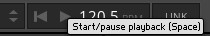
</div>

<br>

<div align="center"> 

</div>


- **EXT** Clock + **Reason** (Or any other external DAW): Only one play button is displayed. Manually do the midi mapping of the middle PLAY button to Reason. Reaktor will  play or stop controlled in sync by the external clock source of Reason. . Note: Ableton can start play in Reaktor if the sync option is selected in the midi output ports settings. Reaktor does not have a modular block to control the start/stop control inside the rack when EXT clock source is selected

### Mute 
Mute the selected track (all 3 if LINK selected). The sequencer track continue running, no MIDI output.

### Reset
Reset the track position to the start on the selected track (all 3 if LINK selected). The start position is 1 or the last step, depending on the sequencer track direction mode. 

### Pause
Pause the selected track (all 3 if LINK selected). The sequencer track stops, no MIDI output. Clock continue running. Once pause is disabled, the sequencer track will play again.   

### Step 
Advance one step the selected track (all 3 if LINK selected). This is useful to test your sequence.  


## CONTROL

<div align="center"> 
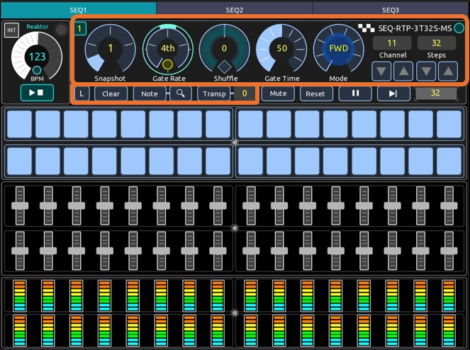
</div>

### Snapshots
The template supports a **snapshot** ( or preset) functionality, which allows you to save and recall up to four configuration values on each sequencer track: note, gate, velocity and controls ( gate rate, shuffle, gate time, mode and steps). MIDI channel does not change. Each time you select a snapshot,  it automatically changes the value in the teamplate and in the Reaktor rack. But be aware it is no bidirectional, it only works from the template to Reaktor. So if you change a value in the Reaktor rack, it will not be updated back to the template. The template has the "master" values. If you need to start from zero, just run press CLEAR with LINK enabled to clear all values at once in the 3 sequencer tracks. Repeat it for each snapshot. 

<br>

<div align="center"> 

</div>

<br>

### Link
Links the execution of commands, to execute it simultaneously on the 3 sequencer tracks. The commands that works with "LINK" are: SNAPSHOT, CLEAR, NOTE, TRANSP, MUTE, RESET, PAUSE, and STEP. Press the **L** button and the linked controls will change color to yellow. 

<div align="center"> 

</div>

### Gate Rate
Selects the gate rate on each track: 4th, 8th, 16th, 32th and 64th.

### Shuffle
Selects a shuffle on each track to introduce variations in the rythm: -50% to 50%. The diamond shaped button return shuffle to 0%.

### Gate Time
Selects a gate time on each track: 0 to 100

### Mode
Selects one out of the 8 sequencer modes: FWD, REV, FWD-REV, TRI, PATT1, PATT2, RAND, GLITCH. 

- **FWD** (forward) = The sequence plays forwards.
- **REV** (reverse) = The sequence is reversed.
- **FWD-REV** (forward then reverse) = The sequence plays forwards and then backwards, for example: 1,2,3,4,4,3,2,1,1,2,3,4 etc.
- **TRI** (triangle) = Same as FWD-REV but adds an extra step at the end so that the first and last steps aren't repeated, for example: 1,2,3,4,5,4,3,2,1,2,3,4,5 etc.
- **PATT 1** (pattern 1) = Plays back the sequence using a pattern.
- **PATT 2** (pattern 2) = Plays back the sequence using a different pattern.
- **RAND** (random) = Plays back the steps randomly.
- **GLITCH** = Same as FWD except every so often plays a random step.

### Channel
Selects the midi output channel for each sequencer track. Use either an available midi channel in your audio interface that is not used by any other instrument and/or use a virtual MIDI port in your computer, that is not used or reserved by any other DAW or application. On a PC you can use [loopMIDI](https://www.tobias-erichsen.de/software/loopmidi.html) to create virtual ports. On a Mac, you can use the IAC bus to create any number of virtual MIDI buses, the driver can be activated in the Audio MIDI Setup Utility.

### Steps
Selects the number of up to 32 steps per sequencer track. The steps that are not used, change to a hidden state in the template, so you have a visual feedback of the steps available. 

<div align="center"> 
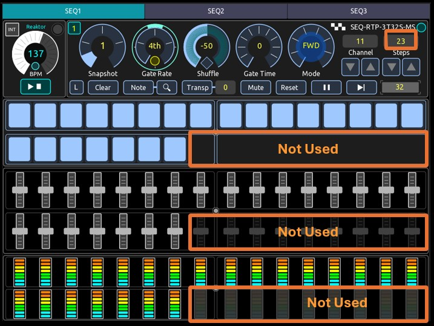
</div>

### Clear
Initializes the values of the sequencer track (all 3 if LINK selected) to the following values: 
- **GATE** = ALL SELECTED (1)
- **NOTE** = C3 (middle C)
- **VELOCITY** = 100
- **Gate Rate** = 4th
- **Shuffle** = 0%
- **Gate Time** = 50
- **MODE** = FWD
- **Steps** = 32 

Ocassionaly the template and reaktor rack files could be out of sync if you either does not save on sync the rack file and the template to keep the same values, or if you change the values directly in the reaktor rack. To return to a default configuration, just use the repository files, to start a new session from scratch. 


### Note display and zoom
Display the pitch values of each step on top of each step gate. Additionally a zoom button extend the note faders to allow for an easy input of notes. The convention used for numbering keys (notes) is where MIDDLE C (note #60) is C3. The piano scales convention, Middle C is designated as "C4". The "C3 Convention" used here, is the most commonly used octave designation system on standard MIDI keyboards, most DAWs and Reaktor.  

<div align="center"> 
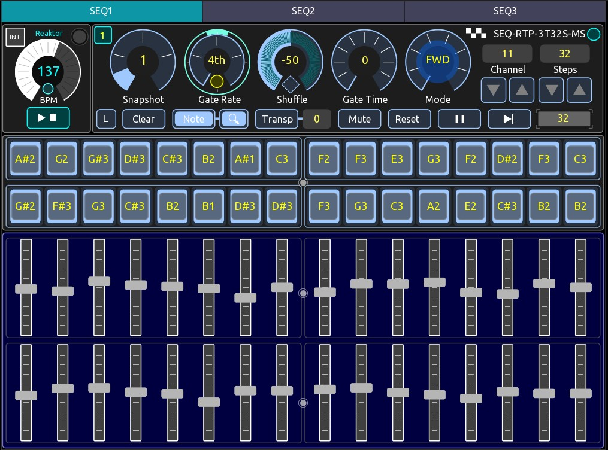
</div>


### Transpose
The template has a -24 to + 24 interval keyboard to transpose the sequence the tracks (all 3 if LINK selected) without the need of an external midi controller. When you select transpose it displays the transpose keyboard on top of the velocity group. It also displays the transpose interval according to the key pressed, being C3 the central key. When you release transpose, the transpose keyboard returns to a hidden state. 

<div align="center"> 
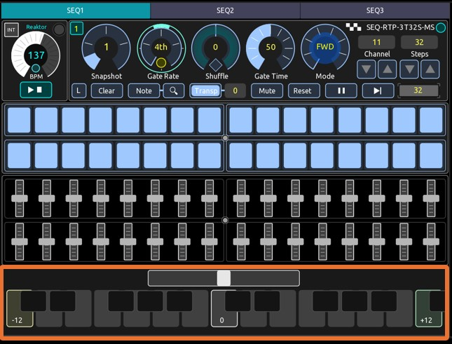
</div>


<br>


## SEQUENCER

<div align="center"> 
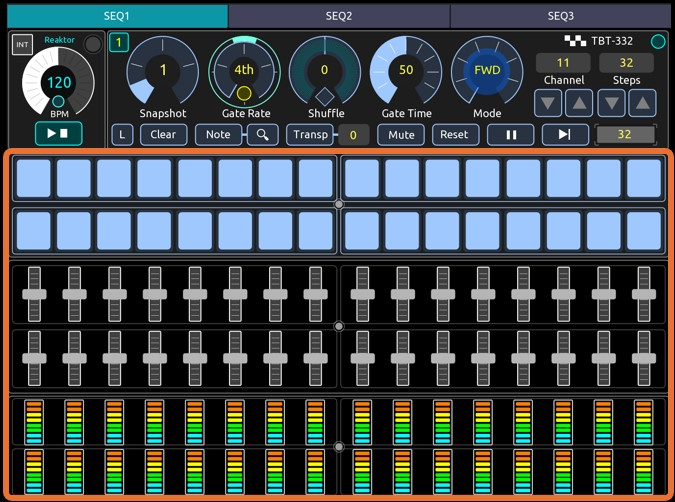
</div>

### Gate 
Select each step to play it or not. It can be changed at any time and its value is stored automatically in the corresponding snapshot. But remember to mannualy save the template if you close it to keep the values. Depending on the number of steps selected, the gate steps can be displayed or hidden. 

### Note (Pitch) 
Select the value of the note on each step. It can be changed at any time and its value is stored automatically in the corresponding snapshot. But remember to mannualy save the template if you close it to keep the values. Depending on the number of steps selected, the note steps can be displayed or hidden. The note value can be displayed when you press the Note button. If you press the zoom button, the note faders are expanded so you can more easily touch the fader to input a note value. 

### Velocity
Select the value of the velocity (volume level) on each step. Remember that the velocity signal will work only if your virtual or external instrument supports velocity control. It can be changed at any time and its value is stored automatically in the corresponding snapshot. But remember to mannualy save the template if you close it to keep the values. Depending on the number of steps selected, the velocity steps can be displayed or hidden. The velocity value is displayed automatically in a pop up box over the note group when you move a fader.


## CONNECTIONS
- Reaktor Mapping: OSC. Already configured in the Reaktor rack file. No need to stup.
- DAW Host Mapping:  MIDI. Manualy do the midi mapping in the PLAY, STOP and BPM controls between teh template and your DAW
- TouchOSC Connections: Manualy do the following configuration in your tablet device:
	- MIDI Connection 1 : Send Port: Bridge, Receive Port: Bridge
	- OSC Connection 1: Host (IP of your PC host), Ports: send 10000, receive 10000
	- OSC Connection 2: Host (IP of your PC host), Ports: send 12101, receive 12101   (This connection is required to send keystrokes)
	- Bridge: Host(IP of PC host)
- Virtual MIDI interface: Virtual midi ports on the PC or MAC to communicate Reaktor with the DAW. Manually do the neccesary configurations
- Physical MIDI: To communicate Reaktor with external gear. Manually do the neccesary configurations
- Reaktor OSC Configuration: 
	- OSC Activate ON 
	- Receive on Port 10000 
	- OSC Send (Identifier Target, Tablet device IP address, Port 10000)
	
## REAKTOR RACK
The **CUSTOM BUILT** Reaktor rack consist of the following modular blocks,  most of them are from the ToyBox Tangle Pack set. Go to [Toy Box](https://www.toyboxaudio.com/) to get it. 
- Sequencer
	- 3 Counter 
	- 3 Position 
	- 4x3 (12) Note 
	- 6x3 (18) Gate 
	- 4x3 (12) Level
	- 3x3 (9) Sum  
	- 3 Multiply (Merge)
	- 3 Clock 
	- 3 Macro Knobs
- Utility
	- 2 Gate
	- 2 Sum
	- 4 Multiply
	- 2 Invert
	- 1 Transpose
	- 1 Sample & Hold
	- 1 MIDI out (3 ports)
	- 1 OSC out (11 used)

All blocks are already OSC mapped with the template (inputs and outputs). You will only need to configure the OSC and MIDI connection settings in Reaktor according to your setup. 

<div align="center"> 
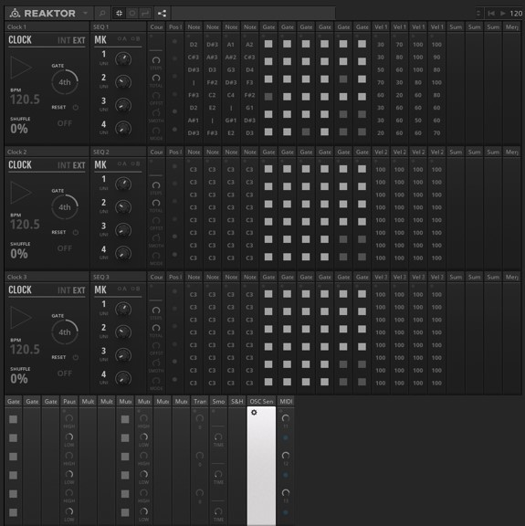
</div>

<div align="center"> 
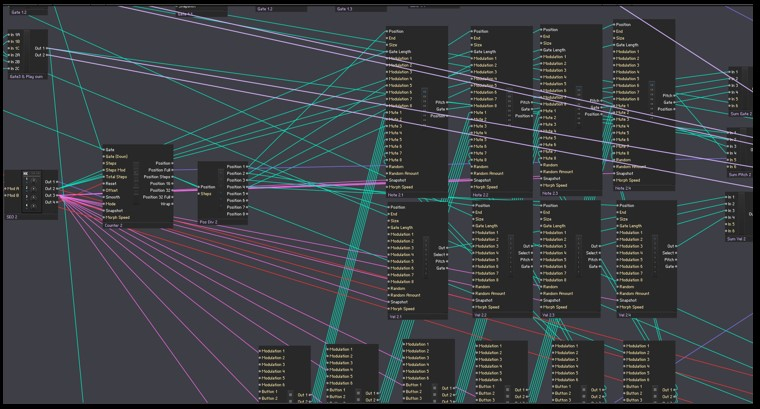
</div>

<br>

## IMPORTANT NOTES

> [!CAUTION]
> ** Counter Block calibration **. Values configured in the knob 1 of the macro knobs SEQ1, SEQ2 SEQ3, are setup with a value = 60.1 . Do not change it. This value is calibrated to the smooth input of the the Counter block to generate a smooth ramp for the sequencer to work properly.  

<br>

> [!IMPORTANT]
> ** PLAY Reaktor in EXT - Reason clock mode. ** . **SPACE BAR** is used to Play/Stop in this mode, but unfortunately there is no option to control it with a block. The template sends a **space-bar** keystroke when you press the Play/Stop. You need to have the **focus** over the Reaktor window to work. If you have a Stream Deck device it will help for your workflow. 


 
