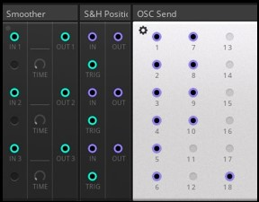

## Reaktor ToyBox Tangle Pack Sequencer
### TouchOSC template for a custom-built Reaktor rack sequencer

- Instrument: Reaktor [ToyBox Tangle Pack](https://www.toyboxaudio.com/pages/tangle-pack) Sequencer, 3 tracks, 32 steps, MIDI
- Model: TBT-332 (custom-built)
- Version: 1.0 
- 


## USER GUIDE
This guide explains the setup, usage and control of the **custom-built** Reaktor ToyBox Tangle Pack Sequencer. 

## Contents
- [TRANSPORT](#transport)
- [CONTROL](#control)
- [SEQUENCER](#sequencer)
- [CONNECTIONS](#connections)
- [REAKTOR RACK](#reaktor-rack)
- [IMPORTANT NOTES](#important-notes)


## TRANSPORT

<div align="center"> 

</div>

### Clock
Selects Internal, Ableton Link or an External clock source. The Play and Stop controls and BPM scales change depending on the option selected. When you press and toggle INT, two options are available by pressing the right round button: **Link Ableton** and **EXT Reason**. The EXT option shows **Reason** because the template has the BPM values already scaled to this DAW. But you have the option to change it if you use any other external DAW. 

- **INT**: This option selects **Reaktor** as the clock source. You could use Reaktor as the master clock source for your setup if you select the option "Send clock to MIDI ouput" in the Reaktor settings menu.

- **LINK**  **Ableton Link**: This option selects Ableton Link as the clock source. Manually Enable **Link** in both Ableton as and Reaktor.  

- **EXT**  **Reason** : This option selects an external DAW clock source. The template displays **Reason** because the BPM values are already scaled for Reason. But you can change to your DAW and modify the script to match the BPM scales of your DAW. 


<div align="center"> 

</div>

<br>

<div align="center"> 

</div>

<br>

### BPM
Selects the BPM values for the 3 sequencers depending on the clock source: 

- **INT** : Use the BPM values from the Reaktor rack. Values are from 1 to 240. Already OSC mapped. 

- **EXT - Ableton Link** : Use the BPM values from the Ableton DAW. Values are from 20 to 240. Manually edit the midi mapping and set the BPM scale in Ableton to the max value of 240. 

- **EXT - Reason** : Use the BPM values from the Reason DAW (or any other you use). Default values are from 1 to 244. Manually edit the midi mapping. If you use any other DAW, modify in the template script the MIDI Control Change message of the **BPMRS** control to set the scale to your DAW as needed. The default CC scale for Reason is setup from 0 to 30. To change the name to your DAW, locate in the script the INTEXT and DAW controls the variable **daw_ext** and change its value. 

Pressing the BPM value on the center of the control, initialize BPM to 120. 
 
<div align="center"> 

</div>

```
local daw_ext = 'Reason'      -- Change it to your DAW as needed

````

<br>

### Play / Stop
Play and Stop the 3 sequencer tracks. It has 3 modes of operation, depending on the selected clock source:


<div align="center"> 

</div>

<br>

- **INT** clock mode: PLAY/STOP play and stop Reaktor rack. Only one play button is displayed that is mapped to Reaktor.

- **EXT** CLock + **Ableton Link** : Two play buttons are displayed, the left one is for Reaktor and the right one is for Ableton. Manually edit the midi mapping of the middle PLAY button to Ableton. Reaktor can play or stop independently of Ableton, but it is linked in beat, phase and tempo to the master clock of Ableton Link. **Note:** Ableton can start Reaktor play if the sync option is selected in the midi output ports settings. Reaktor does not have a modular block to control the start/stop control inside the rack when the EXT clock source is selected. In this case play/stop control works with a **[SPACE BAR]** message and requires to have the "focus" on the Reaktor window. A stream deck device would help the workflow. The **PLAY_SPACE** control in the script use OSC Connection 2 to send a keystroke SPACE message to TouchOSC Bridge host port 12101, which in turn is send to Reaktor window.


<div align="center"> 

</div>

<br>

<div align="center"> 

</div>

<br>


- **EXT** Clock + **Reason** (Or any other external DAW): Play control is from Reason (or your DAW). Only one play button is displayed. Manually edit the midi mapping of the middle PLAY button to Reason (or your DAW). Reaktor will  play or stop controlled Reason (or your DAW).

### Mute 
Mute the selected track (all 3 if LINK selected). The sequencer track continues running, no MIDI output.

### Reset
Reset the track position to the start on the selected track (all 3 if LINK selected). The start position is 1 or the last step, depending on the sequencer track direction mode. 

### Pause
Pause the selected track (all 3 if LINK selected). The sequencer track stops, no MIDI output and clock continues running. When pause is disabled, the sequencer track will restart playing again.   

### Step 
Manual one step forward the selected track (all 3 if LINK selected). This is useful to test your sequence.  

<br>

## CONTROL

<div align="center"> 

</div>

### Snapshots
The template features a **snapshot** (preset) functionality, which allows you to save and recall up to four sets of values for each sequencer track: note, gate, velocity and controls (gate rate, shuffle, gate time, mode and steps). MIDI channel does not change when changing snapshots. Each time you select a snapshot, it automatically changes the values in the template and in turn updates the values in the Reaktor rack. It is not bidirectional, it only works in one direction: from the template to Reaktor. So if you change a value in the Reaktor rack, it will not be updated back to the template. It is not necessary  to change the values in the Reaktor rack, do it in the template. If you need to start from zero, just press CLEAR with LINK enabled to clear all the values at once in the 3 sequencer tracks. Repeat it for each snapshot. 

<br>

<div align="center"> 

</div>

<br>

### Link
Links the execution of some controls simultaneously on the 3 sequencer tracks. The controls with "LINK" feature are: SNAPSHOT, CLEAR, NOTE, TRANSP, MUTE, RESET, PAUSE, and STEP. Press the **L** button and the linked controls will change its color to yellow. 

<div align="center"> 

</div>

### Gate Rate
Selects the gate rate on each track: 4th, 8th, 16th, 32th and 64th.

### Shuffle
Selects a shuffle on each track to introduce variations in the rhythm: -50% to 50%. Press the diamond shaped button to return shuffle to 0%.

### Gate Time
Selects a gate time on each track: 0 to 100

### Mode
Selects one out of the 8 sequencer modes: FWD, REV, FWD-REV, TRI, PATT1, PATT2, RAND, GLITCH. 

- **FWD** (forward) = The sequence plays forwards.
- **REV** (reverse) = The sequence is reversed.
- **FWD-REV** (forward then reverse) = The sequence plays forwards and then backwards, for example: 1,2,3,4,4,3,2,1,1,2,3,4 etc.
- **TRI** (triangle) = Same as FWD-REV but adds an extra step at the end so that the first and last steps aren't repeated, for example: 1,2,3,4,5,4,3,2,1,2,3,4,5 etc.
- **PATT 1** (pattern 1) = Plays back the sequence using a pattern.
- **PATT 2** (pattern 2) = Plays back the sequence using a different pattern.
- **RAND** (random) = Plays back the steps randomly.
- **GLITCH** = Same as FWD except every so often plays a random step.

### Channel
Selects the midi output channel for each sequencer track. Use either an available midi channel in your audio interface that is not used by any other instrument and/or use a virtual MIDI port in your computer, that is not used or reserved by any other DAW or application. On a PC you can use [loopMIDI](https://www.tobias-erichsen.de/software/loopmidi.html) to create virtual ports. On a Mac, you can use the IAC bus to create any number of virtual MIDI buses, the driver can be activated in the Audio MIDI Setup Utility.

### Steps
Selects the number of up to 32 steps per sequencer track. The steps that are not used, change to a hidden state in the template and touch control disabled.

<div align="center"> 

</div>

### Clear
Initializes the values of the sequencer track (all 3 if LINK selected) to the following values: 
- **GATE** = All ON (1)
- **NOTE** = C3 (middle C)
- **VELOCITY** = 100
- **Gate Rate** = 4th
- **Shuffle** = 0%
- **Gate Time** = 50
- **MODE** = FWD
- **Steps** = 32 

Occasionally the template and the Reaktor rack files could be out of sync if you either does not save the rack file and the template at a time to keep the same values, or if you change the values directly in the Reaktor rack. To return to a default configuration, just use the repository files to start a new session from scratch. 


### Note display and zoom
Display the pitch values of each step on top of each step gate. The zoom button :mag: extends the note faders to allow for an easy input of notes. The convention used for numbering keys (notes) is where MIDDLE C (note #60) is C3. The piano scales convention, Middle C is designated as "C4". The "C3 Convention" used here, is the most used octave designation system on standard MIDI keyboards, DAWs and virtual instruments.  

<div align="center"> 

</div>


### Transpose
The template has a -24 to + 24 interval keyboard to transpose the sequence tracks (all 3 if LINK selected) without the need of an external midi controller keyboard. Toggle the **Transpose** button to display the transpose keyboard on top of the velocity group. The transpose interval value is displayed at the right, which corresponds to the key pressed. A **0** value means no transpose when you press the central key **C3**.   

<div align="center"> 

</div>

<br>

## SEQUENCER

<div align="center"> 

</div>

### Gate 
Select each step to play. It can be changed at any time and its value is stored automatically in the corresponding snapshot. The steps available depend on the number of steps selected in the snapshot. 

### Note (Pitch) 
Select the value of the note on each step. It can be changed at any time and its value is stored automatically in the corresponding snapshot. The steps available depend on the number of steps selected in the snapshot. Press the **Note** button to display the  note values. Press the **zoom** button :mag: to expand the faders so you can more easily input a note value. 

### Velocity
Select the value of the velocity (volume level) on each step. The velocity signal will work only if your virtual or external instrument supports velocity control. It can be changed at any time and its value is stored automatically in the corresponding snapshot. The steps available depend on the number of steps selected in the snapshot. The velocity value is displayed automatically  in a pop-up box over the note group when you move a fader.

<br>


## CONNECTIONS
- Reaktor Mapping: OSC, already configured in the Reaktor rack file. No need to setup.
- DAW Host Mapping:  MIDI, manually  do the midi mapping of the PLAY, STOP and BPM controls between the template and your DAW.
- TouchOSC Connections: Manually  do the following configuration in your tablet device:
	- MIDI Connection 1 : Send Port: Bridge, Receive Port: Bridge
	- OSC Connection 1: Host (IP of your PC host), Ports: send 10000, receive 10000
	- OSC Connection 2: Host (IP of your PC host), Ports: send 12101, receive 12101   (This connection is required to send keystrokes)
	- Bridge: Host(IP of PC host)
- Virtual MIDI interface: Virtual midi ports on the PC or MAC to communicate Reaktor with the DAW. 
- Physical MIDI: To send midi to external gear. 
- Reaktor OSC Configuration: 
	- OSC Activate ON 
	- Receive on Port 10000 
	- OSC Send (Identifier Target, Tablet device IP address, Port 10000)
	- See [How to Set Up TouchOSC with Reaktor](https://support.native-instruments.com/hc/en-us/articles/4408082499345-How-to-Set-Up-TouchOSC-with-Reaktor) in Native Instruments support site. 

<br>
	
## REAKTOR RACK
The **custom-built** Reaktor rack using the [ToyBox Tangle Pack](https://www.toyboxaudio.com/pages/tangle-pack). All the blocks are already OSC mapped.
- Sequencer blocks
	- 3 Counter 
	- 3 Position 
	- 4x3 (12) Note 
	- 6x3 (18) Gate 
	- 4x3 (12) Level
	- 3x3 (9) Sum  
	- 3 Multiply (Merge)
	- 3 Clock 
	- 3 Macro Knobs
- Utility blocks
	- 2 Gate
	- 2 Sum
	- 4 Multiply
	- 2 Invert
	- 1 Transpose
	- 1 Smoother
	- 1 Sample & Hold
	- 1 MIDI out (3 ports)
	- 1 OSC out (11 used)

<br>

<div align="center"> 

</div>

<br>

<div align="center"> 

</div>

<br>

The rack uses a **OSC send** block to send feedback OSC signals to the template to control and light the sequencer controls:

- position
- gate
- mute 
- play 

The smoother block is calibrated to 7ms to trigger the S&H and capture a precise position signal. 

<div align="center"> 

</div>

<br>

## IMPORTANT NOTES

> [!CAUTION]
> **Counter Block calibration**. Values configured in knob 1 of the macro knobs SEQ1, SEQ2 SEQ3, are setup with a value = **60.1** . Do not change it. This value is calibrated to the smooth input of the **Counter block** to generate a smooth ramp for the sequencer to work properly.  

<br>

> [!IMPORTANT]
> **PLAY Reaktor in EXT - Reason clock mode** . **SPACE BAR** is used to Play/Stop Reaktor. The template sends a **space bar** keystroke when you press the Play/Stop button. The **focus** over the Reaktor window is required to work. If you have a Stream Deck device it will help for your workflow. 


 
